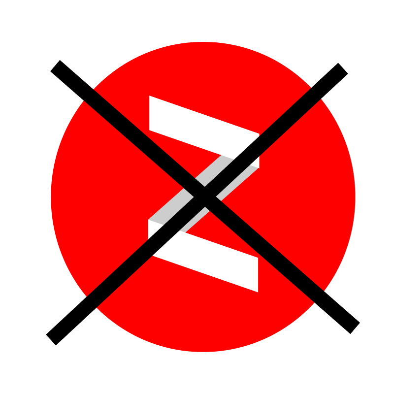

# anti-yandex-zen
Блокировщик Яндекс Дзен для Google Chrome.  
Автоматически удаляет блок Яндекс Дзена с главной страницы Яндекса.

## Ручная установка
* Скачиваем папку __"anti-dzen"__
* В браузере Google Chrome переходим в __chrome://extensions/__
* Нажимаем кнопку __"Загрузить распакованное расширение"__
* Загружаем нашу папку
* Готово

## Установка через Google Webstore
[Anti Dzen](https://chrome.google.com/webstore/detail/anti-dzen/clbmomdplnaennkdehpfcmepcnoiaejn)
